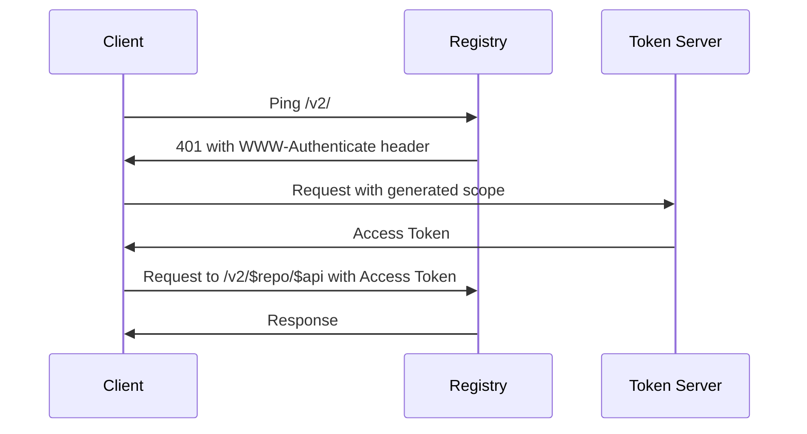

# Moby

The Moby client is the open source upstream of Docker, and the workflow has been widely copied.

## API Workflow

- Ping the v2 endpoint (`GET /v2/`), if 401 (unauthorized status), save values from the `WWW-Authenticate` header
- Manually set scope to `repository:${repo}:${action}` with action = `pull`, `push`, or `pull,push`
- If `from` query parameter seen on request, add additional scope with a `pull` action
- Auth type (basic or token) is determined from v2 ping `WWW-Authenticate` header to set `Authorization` header on all requests to the repository
- For basic auth, the `Authorization` header is set to `Basic $(base64 ${user}:${pass})`
- For token auth:
  - Extract the `realm` and `service` values from the v2 ping
  - If scope has a new entry always get a token, otherwise use token from cache if still valid
  - Use oauth if a refresh token is available to get token
    - Set form values:
      - `service`: from v2 ping
      - `scope`: concatenated list (comma separated) of scopes
      - `grant_type`: `refresh_token` if available, else `password`
      - `refresh_token`: set if available
      - `username`, `password`, `access_type=offline`: for password auth
    - Request is set to the `realm` url
    - Response is parsed for `access_token`, `refresh_token`, `expires_in`, `issued_at`, and `scope`
    - Refresh token is saved for future requests if defined
    - Expiration time is stored: current time or `issued_at` plus max of `expires_in` and 60 seconds
    - Access token is returned
  - Else use basic auth to get token
    - Setup request to `realm` url with query parameters:
      - `service`: from v2 ping
      - `scope`: parameter included for each scope in the array
      - `offline_token=true`: optionally set
      - `client_id`: optionally set
      - `account`: set to username for non-anonymous requests
    - If non-anonymous request, basic auth header is set (`Authorization: Basic $(base64 ${user}:${pass})`)
    - Response is parsed for `token`, `access_token`, `refresh_token`, `expires_in`, and `issued_at`
    - `token` is set to `access_token` if `access_token` is provided
    - Refresh token is stored for non-anonymous requests
    - Expiration time is stored: current time or `issued_at` plus max of `expires_in` and 60 seconds
    - token is returned
  - `Authorization` header is set to `Bearer ${token}`

## Diagram

An initial request to a registry using tokens would have the following diagram:

## References

- `PullImage`: <https://github.com/moby/moby/blob/v24.0.7/daemon/images/image_pull.go#L27>
- `pullImageWithReference`: <https://github.com/moby/moby/blob/v24.0.7/daemon/images/image_pull.go#L82>
- `distribution.Pull`: <https://github.com/moby/moby/blob/v24.0.7/distribution/pull.go#L17>
- `newPuller().puller.pull`: <https://github.com/moby/moby/blob/v24.0.7/distribution/pull_v2.go#L78>
  - `newRepository`: <https://github.com/moby/moby/blob/v24.0.7/distribution/registry.go#L75>
    - `registry.PingV2Registry`: <https://github.com/moby/moby/blob/v24.0.7/registry/auth.go#L172>
      - `challengeManager.NewSimpleManager`: <https://github.com/moby/moby/blob/v24.0.7/vendor/github.com/docker/distribution/registry/client/auth/challenge/authchallenge.go#L46>
      - `simpleManager.AddResponse`: <https://github.com/moby/moby/blob/v24.0.7/vendor/github.com/docker/distribution/registry/client/auth/challenge/authchallenge.go#L71>
      - `challenge.parseAuthHeader`: <https://github.com/moby/moby/blob/v24.0.7/vendor/github.com/docker/distribution/registry/client/auth/challenge/authchallenge.go#L144>
    - `auth.NewTokenHandlerWithOptions`: <https://github.com/moby/moby/blob/v24.0.7/vendor/github.com/docker/distribution/registry/client/auth/session.go#L226>
    - `auth.NewBasicHandler`: <https://github.com/moby/moby/blob/v24.0.7/vendor/github.com/docker/distribution/registry/client/auth/session.go#L511>
    - `auth.NewAuthorizer`: <https://github.com/moby/moby/blob/v24.0.7/vendor/github.com/docker/distribution/registry/client/auth/session.go#L61>
    - `transport.NewTransport`: <https://github.com/moby/moby/blob/v24.0.7/vendor/github.com/docker/distribution/registry/client/transport/transport.go#L33>
    - `NewRepository`: <https://github.com/moby/moby/blob/v24.0.7/vendor/github.com/docker/distribution/registry/client/repository.go#L132>
  - `p.repo.Manifests`: <https://github.com/moby/moby/blob/v24.0.7/vendor/github.com/docker/distribution/registry/client/repository.go#L175>
  - `puller.pullRepository`: <https://github.com/moby/moby/blob/v24.0.7/distribution/pull_v2.go#L105>
  - `puller.pullTag`: <https://github.com/moby/moby/blob/v24.0.7/distribution/pull_v2.go#L351>
    - `ManifestService.Get`: <https://github.com/moby/moby/blob/v24.0.7/vendor/github.com/docker/distribution/registry/client/repository.go#L422>
    - `http.Client.Do - transport - auth.ModifyRequest`: <https://github.com/moby/moby/blob/v24.0.7/vendor/github.com/docker/distribution/registry/client/auth/session.go#L73>
      - `RepositoryScope.String`: <https://github.com/moby/moby/blob/v24.0.7/vendor/github.com/docker/distribution/registry/client/auth/session.go#L155>
      - `basicHandler.AuthorizeRequest`: <https://github.com/moby/moby/blob/v24.0.7/vendor/github.com/docker/distribution/registry/client/auth/session.go#L521>
      - `tokenHandler.AuthorizeRequest`: <https://github.com/moby/moby/blob/v24.0.7/vendor/github.com/docker/distribution/registry/client/auth/session.go#L252>
