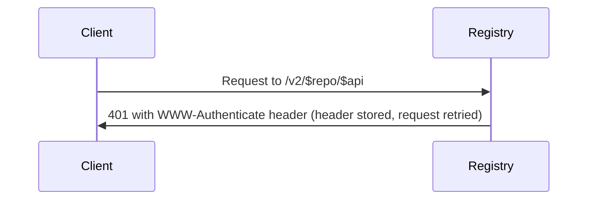
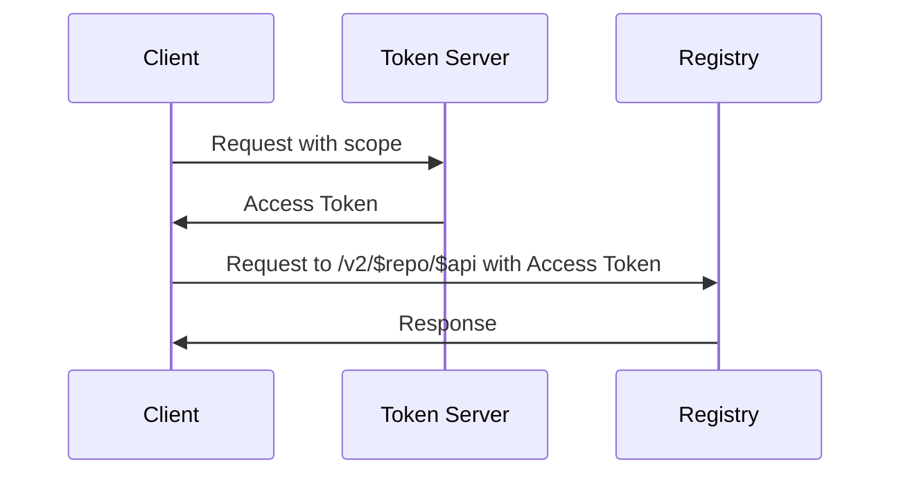
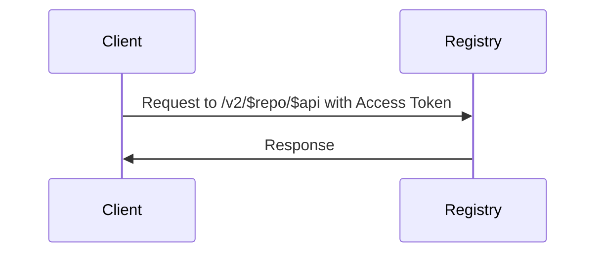

# regclient

The regclient project is a client interface for registries written in Go.

## API Workflow

- Authentication may be tracked per registry or per repository, based on user configuration.
- Each [request](#send-a-request) is run in a retry loop to both handle failures and rerun for authentication.

### Send a Request

- If authentication headers have been seen from previous requests, configure `Authorization` header.
  - [Add a scope](#add-scope) for the current repository in the format `repository:${repository}:${actions}`.
    - For `GET` and `HEAD` requests, actions is `pull`.
    - Actions for all other requests is `pull,push`.
  - Set `Authorization` header using [Basic](#basic-auth-header) or [Bearer Token](#token-auth-header) depending on previous requests.
- Request the API (e.g. `GET /v2/<api>`).
- If unauthorized (401) process the `WWW-Authenticate` header.
  - Parse `WWW-Authenticate` header for auth type and parameters (realm, service, scope) and save for future requests to the host.
  - If scope is unchanged, and the next generated `Authorization` header matches the value from the previous request, fail request as unauthorized.
  - Fail if realm or service unexpectedly change.
  - Append any new scopes.
  - Retry API request, now with authentication header data.

### Add Scope

- A list of requested scopes is tracked for every registry or repository.
- Duplicate entries are skipped.
- Different action values are merged.
- If the scope list is changed, delete any cached token data.

### Basic Auth Header

- If user and password are available, set header to `Basic base64(user:pass)`.

### Token Auth Header

- If token is not defined or expired, generate a new token.
  - Attempt to use a `POST` request.
    - Set form fields:
      - `scope`: space separated list of scopes.
      - `service`: from authenticate header.
      - `client_id`: to the appropriate client value.
      - If a refresh token is available or a token is provided for authentication:
        - `grant_type`: set to `refresh_token`.
        - `refresh_token`: set to the token value.
      - Else if a username/password is available:
        - `grant_type`: set to `password`.
        - `username`: set to the username.
        - `password`: set to the password.
      - Else `grant_type` is not set for anonymous tokens.
    - Request is sent to the `realm` value from the authenticate header.
    - Headers are set on the request:
      - `Content-Type: application/x-www-form-urlencoded; charset=utf-8`.
      - `User-Agent`: set to the appropriate client value.
    - Process the [auth response](#token-auth-response).
  - Fallback to a `GET` request.
    - Create request set to the `realm` value from the authenticate header.
    - Add the following query parameters to the URL:
      - `client_id`: to the appropriate client value.
      - `offline_token`: set to `true`.
      - `service`: from authenticate header.
      - `scope`: add a parameter for each scope value.
    - If username and password are defined:
      - Set the `account` query parameter to the username.
      - Set the basic auth header for the username and password.
    - Headers are set on the request:
      - `User-Agent`: set to the appropriate client value.
    - Process the [auth response](#token-auth-response).
- If token is available (or generated), set header to `Bearer ${token}`.
- Else error with unauthorized request.

### Token Auth Response

- If status code is not 200, fail the response.
- Decode the response body fields: `token`, `access_token`, `expires_in`, `issued_at`, `refresh_token`, `scope`.
- If token expires too soon, set a minimum lifetime.
- If the token has already expired or issued after the current time, reset the issue time to the current time.
- Use the value of `AccessToken` for the value of `Token`.

## Diagram

An initial request to a registry using tokens would have the following diagram:

Subsequent requests if token is not available / expired / scope changed:

Subsequent requests if token is available:

## References

- `reghttp.Next`: <https://github.com/regclient/regclient/blob/v0.5.3/internal/reghttp/http.go#L244>
  - `getAuth`: <https://github.com/regclient/regclient/blob/v0.5.3/internal/reghttp/http.go#L782>
  - `auth.AddScope`: <https://github.com/regclient/regclient/blob/v0.5.3/internal/auth/auth.go#L173>
    - `BearerHandler.AddScope`: <https://github.com/regclient/regclient/blob/v0.5.3/internal/auth/auth.go#L534>
  - `UpdateRequest`: <https://github.com/regclient/regclient/blob/v0.5.3/internal/auth/auth.go#L267>
    - `BasicHandler.GenerateAuth`: <https://github.com/regclient/regclient/blob/v0.5.3/internal/auth/auth.go#L488>
    - `BearerHandler.GenerateAuth`: <https://github.com/regclient/regclient/blob/v0.5.3/internal/auth/auth.go#L599>
  - `auth.HandleResponse`: <https://github.com/regclient/regclient/blob/v0.5.3/internal/auth/auth.go#L203>
